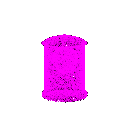
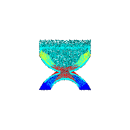
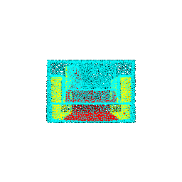
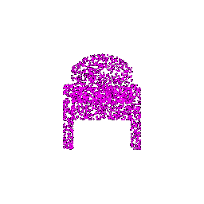
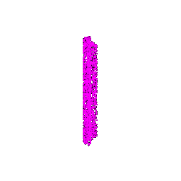
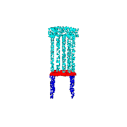

# 16-825 Assignment 5

## Q1. Classification Model 

Test accuracy of my best model is `97.23 %`. I have trained this model for `250` iterations. 

### Visualization of Correct Predictions

| Ground Truth Class | Predicted Class |                         Point Cloud                          |
| :----------------: | :-------------: | :----------------------------------------------------------: |
|     **Chair**      |    **Chair**    |  |
|      **Vase**      |    **Vase**     |  |
|      **Vase**      |    **Vase**     |  |
|      **Lamp**      |    **Lamp**     |  |
|      **Lamp**      |    **Lamp**     |  |

### Visualization of Wrong Predictions

| Ground Truth Class | Predicted Class |                         Point Cloud                          |
| :----------------: | :-------------: | :----------------------------------------------------------: |
|     **Chair**      |    **Lamp**     |  |
|      **Vase**      |    **Lamp**     |  |
|      **Vase**      |    **Lamp**     |  |
|      **Lamp**      |    **Vase**     |  |
|      **Lamp**      |    **Vase**     |  |

As we can see, the wrong predictions look misleading and ambiguous to even to humans. Also, we need to note here that because of class imbalance we hardly mis-classify chairs. There is only a single wrong prediction for chair, but multiple wrong predictions for vase and lamp.    

## Q2. Segmentation Model

Test accuracy of my best model is `92.08 %`. I have trained this model for `250` iterations. 

| Ground Truth Class | Accuracy |                        GT Point Cloud                        |                    Predicted Point Cloud                     |
| :----------------: | :------: | :----------------------------------------------------------: | :----------------------------------------------------------: |
|     **Chair**      | `95.31%` |          |      |
|     **Chair**      | `98.51%` |  |  |
|     **Chair**      | `97.8%`  |  |  |
|     **Chair**      | `67.08%` |          |      |
|     **Chair**      | `71.2%`  |          |      |
|     **Chair**      | `51.6%`  |  |  |
|     **Chair**      | `54.46%` |  |  |


## Q3. Robustness Analysis 

### Rotate the input point clouds by certain degrees

Test accuracy of my best model is `33.15 %` for classification and `30.09 %` for segmentation.

```python
rotation = True
if rotation:
    rotation = torch.tensor([20, 0, 0])
    R = pytorch3d.transforms.euler_angles_to_matrix(rotation, 'XYZ')
    test_dataloader.dataset.data = (R @ test_dataloader.dataset.data.transpose(1, 2)).transpose(1, 2)
```


| Ground Truth Class | Predicted Class |                         Point Cloud                          |
| :----------------: | :-------------: | :----------------------------------------------------------: |
|     **Chair**      |    **Chair**    |  |
|     **Chair**      |    **Lamp**     |  |
|      **Vase**      |    **Vase**     |  |
|      **Vase**      |    **Chair**    |  |
|      **Lamp**      |    **Lamp**     |  |
|      **Lamp**      |    **Vase**     |  |


| Ground Truth Class | Accuracy |                    GT Point Cloud                    |                  Predicted Point Cloud                   |
| :----------------: | :------: | :--------------------------------------------------: | :------------------------------------------------------: |
|     **Chair**      | `33.36%` |  |  |
|     **Chair**      | `33.92%` |  |  |
|     **Chair**      | `16.51%` |  |  |
|     **Chair**      | `22.31%` |  |  |

As we can see rotating the point clouds decreases the accuracy significantly. The network learns the spatial structure of the point clouds but can not deal when the point clouds are rotated.   

### Different number of points points per object 

Modified `--num_points` when evaluating models in `eval_cls.py` and `eval_seg.py` to `2000`. Test accuracy of my best model when  `num_points` is `2000`is `96.12 %` for classification task and `90.09 %` for segmentation task. 

| Ground Truth Class | Predicted Class |                         Point Cloud                          |
| :----------------: | :-------------: | :----------------------------------------------------------: |
|     **Chair**      |    **Chair**    |  |
|     **Chair**      |    **Lamp**     |  |
|      **Vase**      |    **Vase**     |  |
|      **Vase**      |    **Lamp**     |  |
|      **Lamp**      |    **Lamp**     |  |
|      **Lamp**      |    **Vase**     |  |

| Ground Truth Class | Accuracy |                       GT Point Cloud                       |                    Predicted Point Cloud                     |
| :----------------: | :------: | :--------------------------------------------------------: | :----------------------------------------------------------: |
|     **Chair**      | `33.36%` |  |  |
|     **Chair**      | `33.92%` |  |  |
|     **Chair**      | `16.51%` |  |  |
|     **Chair**      | `22.31%` |  |  |

As we can see changing the `num_points` to `2000` doesn't effect the accuracy much. But decreasing it further down might decrease the accuracy. 

## Q4. Expressive architectures

#### Comparison of accuracies of all the models. 

|   PointNet   |  PointNet++   |    DGCNN     | Point Transformers |
| :----------: | :-----------: | :----------: | :----------------: |
| **`97.23%`** | **`98.006%`** | **`98.53%`** |    **`98.11%`**    |

|                         Point Clouds                         | Ground Truth | PointNet | PointNet++ |  DGCNN   | PointFormer |
| :----------------------------------------------------------: | :----------: | :------: | :--------: | :------: | :---------: |
|  |  **Chair**   | **Lamp** |  **Lamp**  | **Vase** |  **Vase**   |
|  |   **Lamp**   | **Vase** |  **Vase**  | **Lamp** |  **Lamp**   |
|  |   **Vase**   | **Vase** |  **Vase**  | **Lamp** |  **Vase**   |

For all the below architectures I only used classification model, and did not use any additional data. This could be the reason we did not see significant difference in accuracies, If we rotate the point clouds like in the previous section, we might see a difference in accuracies. 

### PointNet++

> I have changed the num of points to 2000 from 10000 because of GPU VRAM limitation. 

For PointNet++ we implemented `PointNetSetAbstraction` models that use `farthest_point_sample` and `query_ball_point` functions to sample points in `sample_and_group` function and group points for the point clouds.

### DGCNN

> I have changed the num of points to 2000 from 10000 because of GPU VRAM limitation. 
>

For DGCNN we implemented `knn_graph_feature` function which transforms input features and use `k=20` for the knn. We implement the network by using knn_graph_feature layers followed by conv layers and pooling.  

### Point Transformers

> I have changed the num of points to 2000 from 10000 because of GPU VRAM limitation. 

For Point Transformers we implemented `PointTransformerLayer` which follows transformer like approach. 


